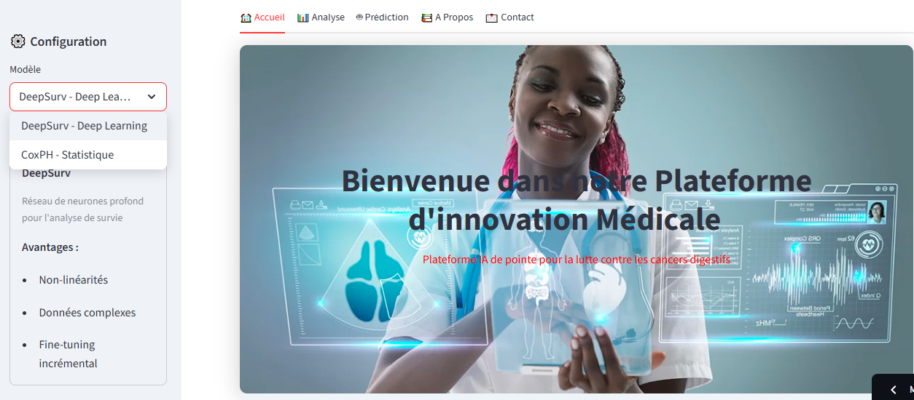

# **shahidi - Plateforme d'Aide à la Décision**

C'est une application interactive développée avec [Streamlit](https://shahidi-ai.streamlit.app/) permettant d'estimer le temps de survie des patients atteints du cancer gastrique après traitement. L'objectif est d'offrir un outil d'aide à la décision basé sur l'intelligence artificielle et l'analyse de survie.


## **Fonctionnalités**
- **Accueil** : Présentation générale de la plateforme.
- **Analyse exploratoire** : Visualisation des données et distribution des variables.
- **Prédiction de survie** : Utilisation de modèles statistiques et d'apprentissage automatique pour estimer le temps de survie.
- **À Propos** : Explication des causes, symptômes et traitements du cancer gastrique.
- **Contact** : Formulaire de contact pour toute question ou suggestion.
---

---

## **Technologies utilisées**
- **Python**
- **Streamlit** pour l'interface utilisateur
- **Pandas** pour la gestion des données
- **Scikit-learn, Scikit-survival & Joblib** pour le chargement des modèles de machine learning
- **TensorFlow/Keras** pour les modèles de deep learning
- **Lifelines** pour l'analyse de survie (modèle de Cox)
- **Plotly** pour la visualisation des données


## **Installation et exécution**
### Cloner le projet
```bash
git clone https://github.com/sefdineahmed/shahidi-decision-support-platform.git
cd Ushahidi
```

### Installer les dépendances
```bash
pip install -r requirements.txt
```

### Lancer l'application
```bash
streamlit run main.py
```

---
## **Modèles de prédiction**
- **DeepSurv (réseau de neurones)**

## **Contact**
📍 **Université Alioune Diop de Bambey, Sénégal**  
📧 **Email** : ahmed.sefdine@uadb.edu.sn  
🌐 **LinkedIn** : [linkedin.com/in/sefdineahmed](https://linkedin.com/in/sefdineahmed)  


Ce projet a été réalisé dans le cadre du mémoire de Master 2 en **Statistique et Informatique Décisionnelle**.
